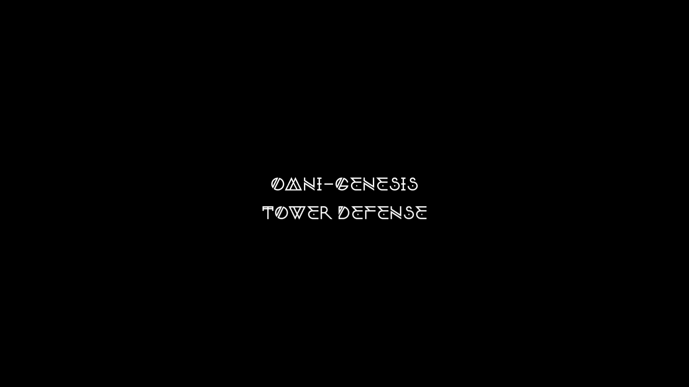
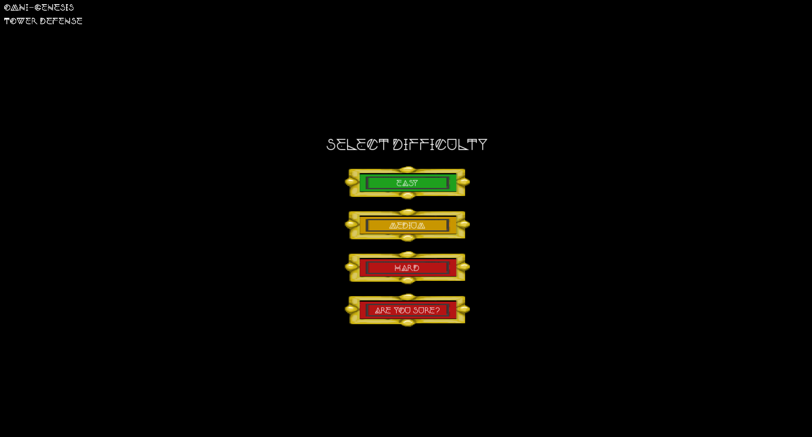
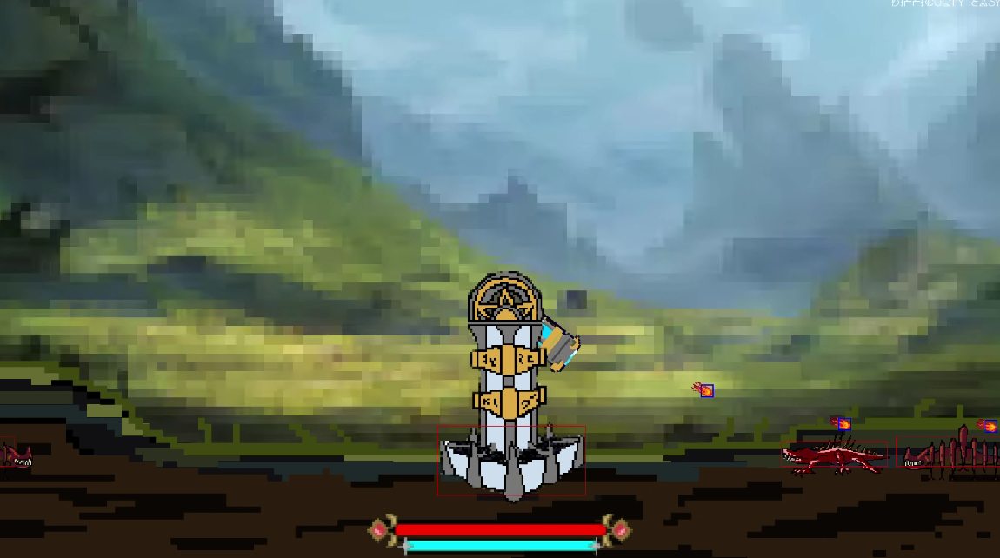
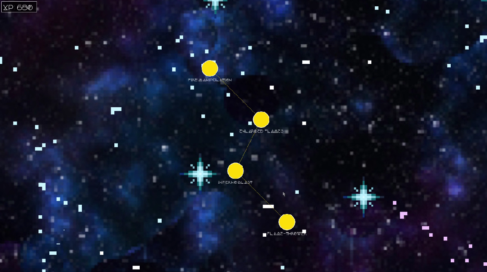

# Omni-Genesis / Tower Defense

> A fantasy tower defense game built with C++ and SFML, featuring a magic skill tree system, multiple enemy types, and wave-based combat.


*Title screen here*

---

## Table of Contents

- [Overview](#overview)
- [Screenshots](#screenshots)
- [Dependencies](#dependencies)
- [Building & Running](#building--running)
- [How to Play](#how-to-play)
- [Controls](#controls)
- [Game Modes & Difficulty](#game-modes--difficulty)
- [Magic System](#magic-system)

---

## Overview

Omni Genesis Tower Defense is a game where you defend a tower from waves of enemies. Defeat enemies to gain XP and learn new magical skills. The game gets harder as you play it. You choose how your game goes...

---

## Screenshots

| Title & Menu | Gameplay | Magic Selection |
|---|---|---|
|  |  |  |

*Replace the above paths with screenshots*

---

## Dependencies

You will need the following installed on your system:

- **g++** with C++17 support
- **SFML 2.x** (Simple and Fast Multimedia Library)
  - `sfml-graphics`
  - `sfml-window`
  - `sfml-system`
  - `sfml-audio`
- **nlohmann/json** — used for loading skill tree data from `.json` files

### Installing nlohmann/json
 
**Ubuntu / Debian:**
```bash
sudo apt-get install nlohmann-json3-dev
```

---

## Building & Running

Clone the repository and use the provided Makefile:

```bash
git clone https://github.com/DarkFlames999/Omni-Genesis-Tower-Defense
cd Omni-Genesis-Tower-Defense
make
```

To build and immediately run:

```bash
make run
```

To clean compiled objects and the binary:

```bash
make clean
```

---

## How to Play

1. Launch the game.
2. From the **Main Menu**, click **Play**.
3. Select your **Difficulty** (see below).
4. Survive waves of enemies by aiming and shooting your cannon.
5. Defeat enemies to earn **XP**.
6. Open the **Magic Selection** screen to choose a magic type and spend XP in its **Skill Tree**.
7. Survive as long as possible!

---

## Controls

| Input | Action |
|---|---|
| **Left Click** | Fire cannon (hold to fire continuously) |
| **Mouse Movement** | Aim cannon |
| **E** | Open / Close Magic Selection menu |
| **Escape** | Back / Return to Main Menu |

---

## Game Modes & Difficulty

| Difficulty | Starting Wave | Description |
|---|---|---|
| Easy | Wave 1 | Start from the beginning |
| Medium | Wave 6 | Skip the early waves |
| Hard | Wave 11 | Jump into the thick of it |
| Are you sure? | Wave 21 | Are you sure? |

---

## Magic System

Press **E** during gameplay to open the Magic Selection screen. Currently available:

- **Bravery** *(unlocked)* - access its full skill tree to upgrade your abilities

The following magic types are planned for future releases:

Determination - Justice - Kindness - Patience - Integrity - Perseverance - Apathy - Fear - Chaos - Wrath - Nihilistic - Deceit - Irresolution

---

## Enemy Types

| Enemy | Speed | HP | XP Value |
|---|---|---|---|
| Juvenile | 100 | 50 | 10 |
| Matured | 120 | 100 | 25 |
| Warden | 140 | 200 | 50 |

---

## Authors

Isaiah Watkins, Konner Knoll, Keali Lake